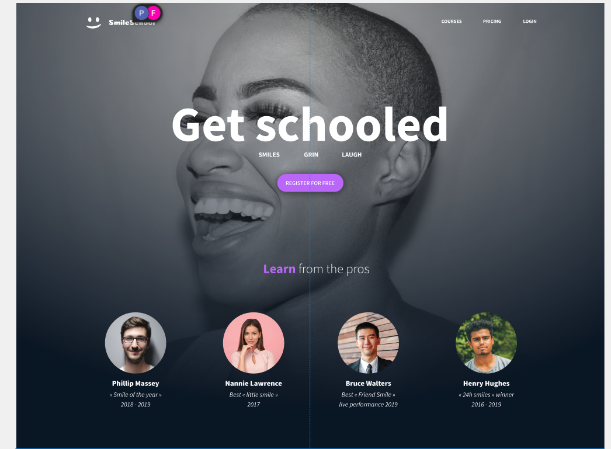
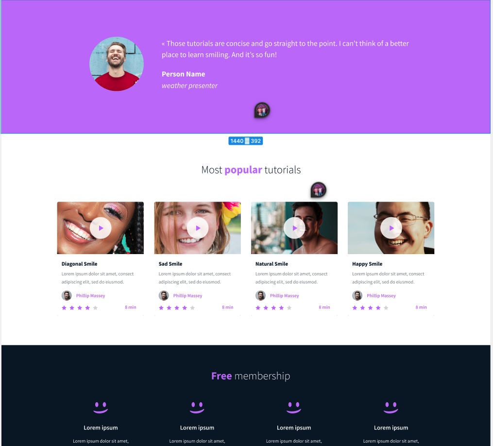
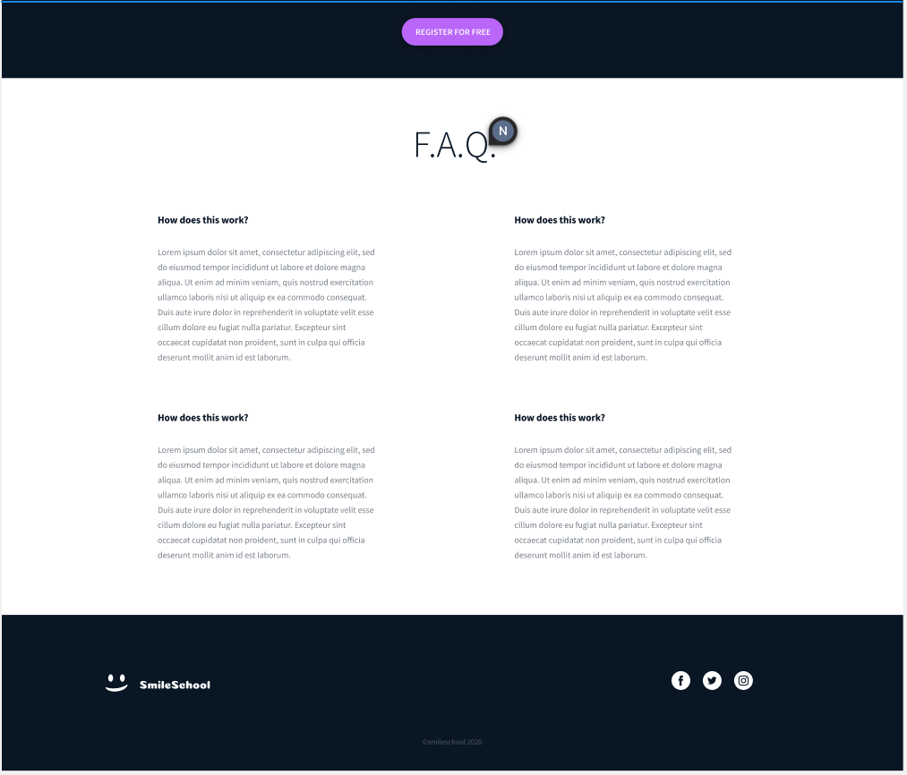

This ALX project focuses on the fundamentals (CSS_BASICS) of CSS styling, applied to four tasks:

1. Some early styling

2. Positioning

3. Responsive web design

4. Additional styling

The following task is applying advanced CSS rules to a school website called "SmileSchool". The website consists of:

1. Navigator
2. Hero Section
3. Feed section
4. FAQ page
5. Footer

Below are the screenshots of what is required to be coded by using HTML and CSS:

